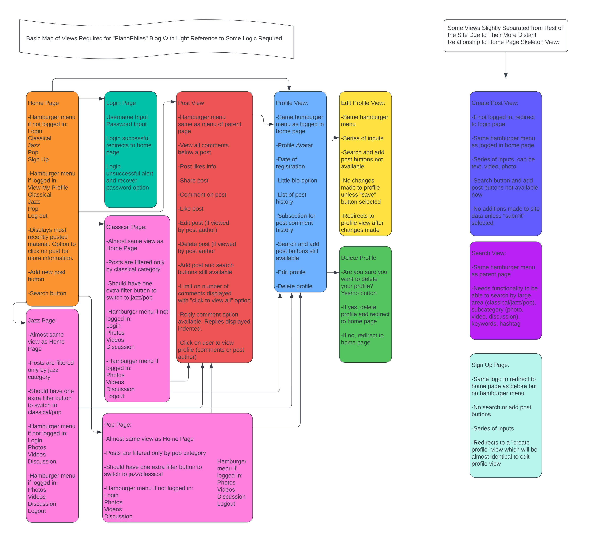
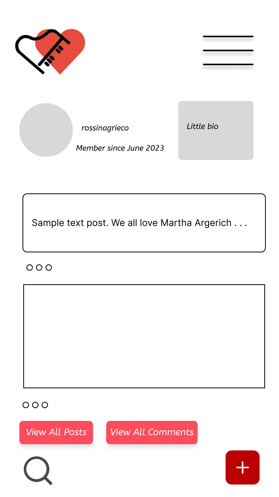
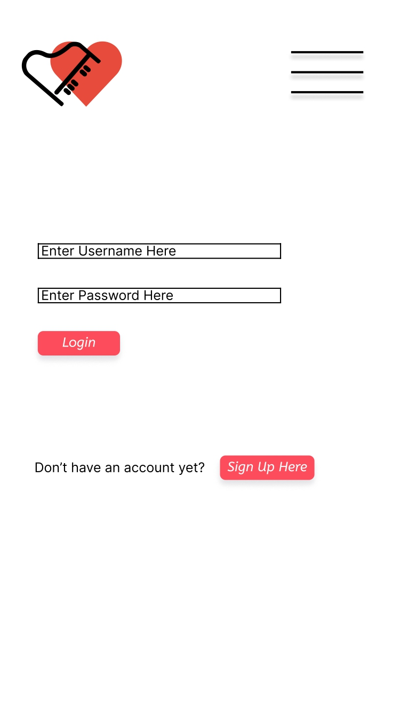
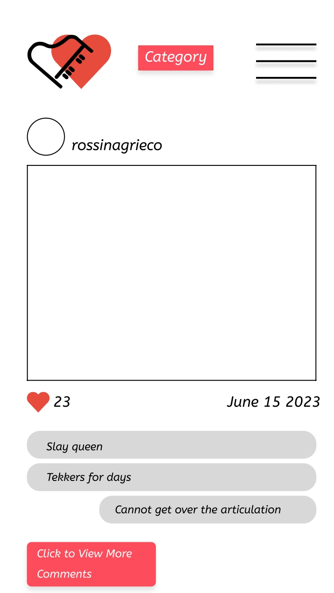

# PianoPhiles

PianoPhiles is a blog site for piano lovers where they can share clips of their favourite performances, post questions about technique or interpretation, or share pictures of their fun piano moments. As well as being able to share content in text, image and video format, users can discuss the material with other likeminded keyboard enthusiasts through comments, show their appreciation with likes and add a personal touch to their own profile page with a short bio and profile photo. Let's get tinkling those keys!

- User Stories
  1. As a user I want to create my own profile, so I have a familiar and comfortable place where I can share my enthusiasm for piano and keep track of discussions.
  2. As a user I want to be able to view all the most recent posts on the site so I can keep my interest fresh and novel.
  3. As a user I want to be able to view all my past posts so I can keep track of my public correspondences.
  4. As a user I want to be able to view all past posts of other users so I can develop understanding and see how other people's opinions develop too.
  5.  As a user I want to be able to comment on posts to allow for interaction and community.
  6.  As a user I want to be able to view all my past comments so I have a written record of my interactions.
  7.  As a user I want to be able to view the comments of other users so I can see how opinions and understanding develop and change.
  8.  As a user I want to be able to edit my profile so that it reflects me as I change.
  9.  As a user I want to be able to delete previous posts I made if I feel they no longer reflect my opinions
  10. As a user I want to be able to delete previous comments I made if I feel they no longer reflect my opinions.
  11. As a user I want to be able to like posts to show appreciation.
  12. As a user I want to be able to delete my profile if I don't feel the community reflects my values any more.
  13. As a user I want to be able to view the site without having to sign up for a profile if I think I would enjoy a more passive rolw on the site.
  14. As a user I want to be able to log in or out of my profile if I feel like "laying low". 

- Site Goal

  - The goal of the site is to create a place where piano lovers can really sink their teeth into their favourite arguments about the art. Spaces like pianostreet used to thrive in the early days of popular widespread internet, but due to their lack of design and ui development, that community has fizzled out and is nowhere near as active as it used to be. It would be nice to resurrect that fun community online where people had ridiculous arguments about interpreting Chopin.

- Target Audience

  -Users of the site are likely to be advanced second level and conservatoire level student pianists and retired amateur pianists; a reflection of the real life piano recital going audience.

- Is the content relevant?

This content is ultimately frivolous, but there I do believe there is a genuine desire for discussion among musicians, and in the Instagram age, what's not to enjoy about the press campaigns of our favourite stars?

- Must Have
The project must have:
    - A home page displaying new posts related to the piano.
    - Login/logout functionality allowing users to maintain anonymity if they so choose.
    - Commenting functinonality so that users can discuss their views.
    - A database that stores user data securely.
    - Video hosting capability.
    - Text hosting capability.
    - Image hosting capability.

- Should Have

    - Profile functionality where users can choose whether or not to share information about themselves, and where they can access their history of activity,     
    notifications etc.
- Ability to like posts.
- Dynamic like button.

- Could Have
    - Live chat feature.
    - Different genres for classical, jazz and pop.
    - Search functionality.
    - Tag functionality so users can search by tags, keywords or genre.

### Structure Plane

### Skeleton Plane

As per the requirements of Code Institute's Portfolio Project 4 assignment, this functions at the most basic level as a CRUD application.

C - Users can create profiles, comments and posts.
R - Users can read the profiles, comments and posts of other users. They can read their own comments and posts.
U - Users can edit their profiles.
D - Users can delete their past comments, posts and their profile.

#### Site Flow

Most of the site should flow centrally from the home page. I used Lucid Chart to make a diagram with a rough outline of how the site should flow.

#### Database Schema

The project utilizes PostgreSQL as the database technology of choice. This is evident from the inclusion of the psycopg2 package in the requirements file, which serves as the PostgreSQL adapter for Python. PostgreSQL is a powerful and feature-rich open-source relational database management system known for its reliability, scalability, and extensive support for advanced data types and SQL features. Additionally, the project leverages the dj-database-url package, which facilitates the handling and parsing of database URLs. This allows for seamless configuration of the database connection using a URL format specified by the PostgreSQL provider. By utilizing these database technologies, the project ensures efficient and secure data storage and retrieval, enabling robust and scalable web application functionality.

Here is an overview of the most important data relationships in the project.

## ERD Diagram

| Model        | Fields                                         | Relationships                            |
|--------------|------------------------------------------------|------------------------------------------|
| User         | id, username, email, password, ...              |                                          |
| Profile      | id, owner_id, created_on, updated_on, bio, ...  | owner (OneToOne with User)                |
| Post         | id, title, slug, author_id, created_on, ...     | author (ForeignKey to User)               |
|              |                                                | likes (ManyToMany with User)              |
| TextPost     | content                                        | parent: Post                             |
| ImagePost    | image                                          | parent: Post                             |
| VideoPost    | video                                          | parent: Post                             |
| PostComment  | id, post_id, author_id, content, ...            | post (ForeignKey to Post)                |
|              |                                                | author (ForeignKey to User)               |

#### Wireframes

I used Figma to make these basic wireframes for how I imagined the website would look.

### Manual Testing

| Test Case                         | Description                                                                                                                   | Expected Outcome                                   | Pass/Fail |
|----------------------------------|-------------------------------------------------------------------------------------------------------------------------------|----------------------------------------------------|-----------|
| User Registration                | Test the registration process by creating a new user profile.                                                                 | User is able to successfully register and is redirected to the home page.                          |  Pass         |
| User Login                       | Test the login functionality by logging in with a registered user account.                                                    | User is able to log in and is redirected to the home page.                                          | Pass   |
| Create a Post                    | Test the ability to create a new post by a logged-in user.                                                                     | Post is successfully created and displayed on the home page.                                       |    Pass       |
| View Recent Posts                | Test the display of recent posts on the home page.                                                                             | Recent posts are displayed correctly on the home page.                                              |    Pass       |
| Comment on a Post                | Test the ability to add a comment on a post.                                                                                   | Comment is successfully added to the post and displayed.                                           |    Pass       |
| View User's Profile              | Test the display of a user's profile page.                                                                                    | User's profile page is displayed correctly with the relevant information.                          |    Pass       |
| Edit User's Profile              | Test the ability to edit the user's profile information.                                                                      | User's profile information is successfully updated.                                               |  Pass         |
| Delete a Post                    | Test the ability to delete a post created by the user.                                                                         | Post is successfully deleted and no longer displayed on the site.                                  |      Pass     |
| Delete a Comment                 | Test the ability to delete a comment made by the user.                                                                         | Comment is successfully deleted and no longer displayed on the post.                               |      Pass     |
| Like a Post                      | Test the ability to like a post.                                                                                              | Post is successfully liked by the user.                                                            |     Pass - can be improved      |
| Logout                           | Test the logout functionality by logging out from a user account.                                                            | User is logged out and redirected to the login page.                                               |      Pass     |
| View Posts of Other Users        | Test the ability to view posts made by other users.                                                                            | Posts made by other users are displayed correctly.                                                 |  Pass         |
| Delete User's Profile            | Test the ability to delete the user's profile.                                                                                 | User's profile is successfully deleted, and all associated data is removed.                        |    Pass       |
| View the Site without Logging In | Test the ability to access the site and view content without logging in.                                                      | User can access and view the site's content without logging in.                                   |     Pass      |
| Dynamic Like Button              | Test the behavior of the dynamic like button on a post.                                                                        | Like button updates and reflects the user's liking/unliking of a post.                            |    Pass - can be improved - not fully dynamic as it acts as a redirect.       |
| Search Functionality             | Test the search functionality to search for posts based on keywords or tags.                                                  | Search results display relevant posts based on the search query.                                  |    Fail       |
| Tag Functionality                | Test the ability to assign tags to posts and filter posts by tags.                                                            | Posts can be assigned tags, and filtering by tags displays relevant posts.                        |     Fail      |
| Live Chat Feature                | Test the functionality of the live chat feature, if implemented.                                                              | Live chat feature functions as expected, allowing real-time communication between users.          |    Fail       |
| Ability to Delete Previous Posts and Comments | Test the ability to delete previous posts and comments made by the user.                                               | User's previous posts and comments are successfully deleted.                                       |  Pass         |

### Deployment

1. Set up a Heroku account:

- Go to the Heroku website (https://www.heroku.com/) and sign up for a new account if you don't have one already.
Install the Heroku CLI:

- Download and install the Heroku CLI (Command Line Interface) based on your operating system. You can find the installation instructions on the Heroku website.

2. Set up your Django project on GitHub:

- Make sure your Django project is hosted on a GitHub repository. If not, create a new repository for your project and push your code to it.

3. Create a new Heroku app:

- Log in to your Heroku account.
From the Heroku dashboard, click on the "New" button and select "Create new app".
Give your app a unique name, choose the region, and click on the "Create app" button.
Connect your GitHub repository to Heroku:

4. In the "Deployment method" section of your Heroku app dashboard, select the "GitHub" option.
Search for your repository name and click on the "Connect" button to connect your GitHub repository to Heroku.
Configure environment variables:

5. In the "Settings" tab of your Heroku app dashboard, click on the "Reveal Config Vars" button.
Add any necessary environment variables your Django project requires (e.g., SECRET_KEY, DATABASE_URL, etc.).
If using Cloudinary for hosting static files, include the necessary Cloudinary environment variables (e.g., CLOUDINARY_URL, CLOUDINARY_API_KEY, CLOUDINARY_API_SECRET, etc.).
Set up the PostgreSQL database:

6. In the "Resources" tab of your Heroku app dashboard, search for "Heroku Postgres" in the "Add-ons" section and select the plan that suits your needs.
Once the Postgres add-on is provisioned, you can access the database credentials in the "Settings" tab under the "Config Vars" section.

7. Create a Procfile:

- In your Django project's root directory, create a file named "Procfile" (without any file extension) and add the following line:

"web: gunicorn your_project_name.wsgi --log-file"

8. Replace "your_project_name" with the actual name of your Django project.
Install necessary dependencies:

- Make sure your Django project's dependencies are listed in a requirements.txt file. You can generate this file using the command pip freeze > requirements.txt in your project's virtual environment.

9. Configure static files and Cloudinary:

- Install the necessary packages for Cloudinary integration, such as cloudinary and dj3-cloudinary-storage.
In your Django project's settings.py file:

10. Set STATIC_URL = '/static/' to define the URL for serving static files.
- Set STATICFILES_STORAGE to use Cloudinary for storing static files. Use the value 'cloudinary_storage.storage.StaticHashedCloudinaryStorage'.
- Set DEFAULT_FILE_STORAGE to use Cloudinary for storing uploaded media files. Use the value 'cloudinary_storage.storage.MediaCloudinaryStorage'.
- Make sure CLOUDINARY_URL, CLOUDINARY_API_KEY, CLOUDINARY_API_SECRET, and other necessary Cloudinary environment variables are correctly configured.

11. Configure Debug and static file collection settings:

- In your Django project's settings.py file:
- Set DEBUG = False to disable debug mode in production.
- Set DISABLE_COLLECTSTATIC = 1 to prevent Heroku from running the collectstatic command during deployment. This is  important because static files are already being handled by Cloudinary and don't need to be collected.

12. Commit and push changes:

- Make sure all your changes, including the Procfile, requirements.txt, and updated settings.py file, are committed and pushed to your GitHub repository.
Deploy your app on Heroku:

13. In the "Deploy" tab of your Heroku app dashboard, scroll down to the "Manual deploy" section. You can enable automatic deployments for every time you push your code.
- Click on the "Deploy Branch" button to deploy your app from the GitHub repository.
Monitor the deployment:

- Once the deployment is initiated, you can monitor the build progress in the "Activity" tab of your Heroku app dashboard.
- If the build process encounters any errors, you can check the logs by clicking on the "View Logs" button.
Verify your deployed app:

14. After a successful deployment, Heroku will provide you with the URL of your app.
Open the URL in your browser to verify that your Django app is running correctly on Heroku.
Check if static files are being served properly and if Cloudinary is being used for hosting and retrieving static files.
- Your Django app should now be deployed and running on Heroku, with static files being served from Cloudinary. 

  - Django docs
  - Bootstrap Docs
  - W3Schools

Yes! We'd strongly encourage you to look at the source code of the `uptime.sh` file so that you know what it's doing. As future software developers, it will be great practice to see how these shell scripts work.

---

Happy coding!
